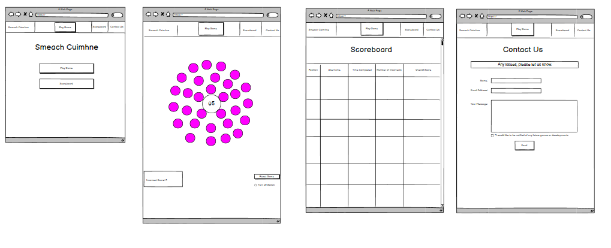
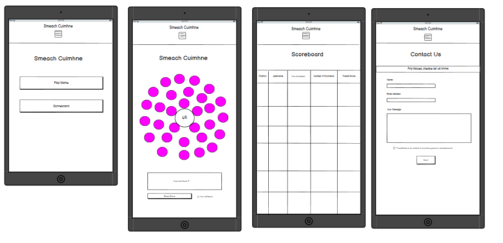
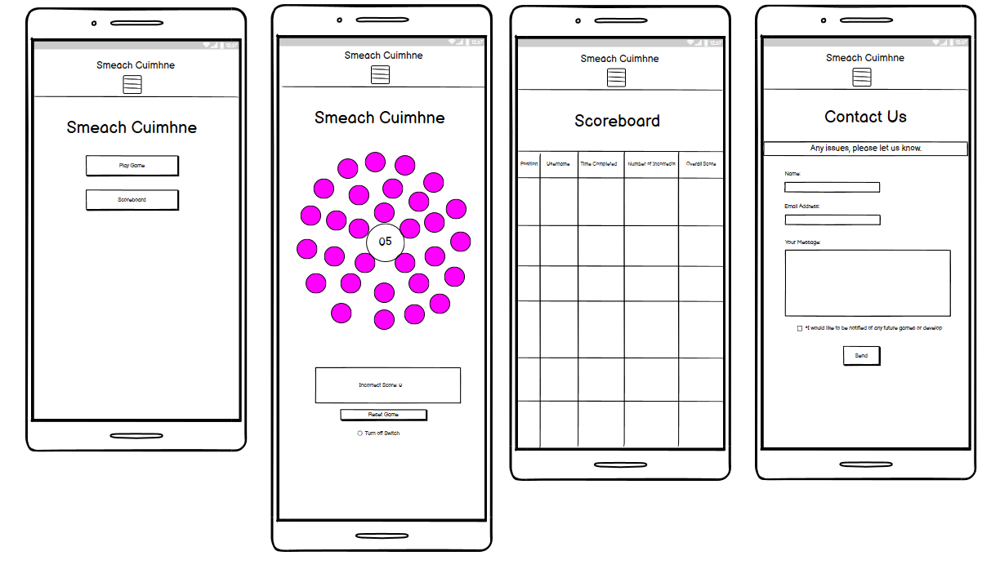

# Project Name - Smeach Cuimhne (Memory Flip)

11/05/2021  
The purpose of the Smeach Cuimhne project is to create an online game that is fun, engaging, and competitive for the user that also tests their memory. 

The overall premise of this game is the following:

- Users are presented a board of 30 covered icons and it is their objective to pair the matching icons and clear the board. 
- However, where this game differs from the usual matching format is that when a user gets a pair wrong, the tiles/icons switch places creating a higher emphasis on getting the right pairs and punishing the users with poor memory (hehe). 
- Users overall score is based on correct pairs achieved, incorrect attempts made and time it takes for the user to clear the board. 
- The goal is to clear the board, making as few incorrect pairs as possible in the shortest timeframe possible. 

## Table of Contents:

- [UX](#-UX)  
- [Features](#-Features)  
- [Technologies Used](#-Technologies-Used)  
- [Testing](#-Testing)  
- [Deployment](#-Deployment)  
- [Credits](#-Credits)  

## UX

The UX for this project will be investigated through the following 5 planes:

### Strategy Plane:  
Is content culturally appropriate? Yes. I don’t think anyone will take any offence to the content within this game. The design will be pallatable for both children and adults alike.

Business goals? Why are we special?  
As far as my research can tell, there are no other games that have this switching aspect included in their game, which separates it from the pack.

Who are competitors? What are they doing?  
The main competitors are the [Helpful Games](https://www.helpfulgames.com/subjects/brain-training/memory.html) and [Match the Memory](https://matchthememory.com/colors ) which offer your basic card matching format. 

You are presented with a table of covered cards and the user is to try and match them. There are probably many more examples of this type of game in circulation, as it is a premise as old as time itself, however these are the main ones I can find currently online.

Tech considerations?  
Main tech which will be used to create this will be HTML, CSS and Javascript.

Building for mobile demographic or scientific/formal demographic?  
This game will be primarily built with the mobile demographic in mind seeing as everything is done through mobile these days. I want to create a game that is easy to understand and is equally engaging for toddlers to seniors and everyone in between. Therefore, this game will be operational on desktop, mobile and tablet devices. 

Why would a user want this? Purpose of site?  
A user would want this to test their memory in a fun and engaging environment. With a clear game objective and scoring system in place, the user also has incentive to come back and replay the game to try and beat their previous score. I am also hoping to implement a scoreboard to help add a bit more competitiveness to the format. 

Who is my target audience? Is my product for businesses or for general consumers?  
My target audience is the general consumer. Someone who is bored and looking for something that is equal parts engaging, fun and testing. There is no age limit on this game so anyone can essentially pick up the game and play.

For consumers:  
When you go to a particular site, where do you go first?  
Users are brought to a screen where they have option to play the game straight away. I do not want to create a login format (at this stage) that can potentially hamper this process. My goal is to have a game where a user can click “Play Game” and be brought through straight away. Once “Play Game” has been clicked, they will be brought to the board.

And why do you go there in particular?  
To play the game.

What would you put off doing when you got there and why?  
Potentially login but at this stage undecided whether I will include this feature or not. Also read the rules because who really reads the handbook for a game they are about to play. Ideally I would like to avoid having a playbook. If a playbook is needed I dont think I have designed this well enough. 

How often do you visit the application? How often do you use it?  
As often or as little as the user wants. I want to create a game that is fun and rewarding to play, therefore creating replay-ability and encouraging user to pick up game and play again. 

What do you most use it for?  
To test your memory in a fun and engaging environment. 

What makes a good experience?  
A game that is easy to pick up and play straight away, is rewarding and captures the users attention from the beginning. In addition, a problem with a lot of these types of games is that they feel like a waste of time to play. By having a clear and concise end goal in place helps users aim for something and try to do better in their next playthrough. 

What's worth doing?

Opportunity/Problem | Important | Feasability/Viability 
--- | --- | ---
Pattern matching game with 30 tiles on board | 5 | 5 |
Pattern switch when false pattern made. How to highlight pattern switch | 5	| 4
Scoreboard that logs all users scores to database | 3 | 3
User login to allow easier score logs and commercially for marketing opportunities | 1 | 4
Toggle on/off switch set up to decrease difficulty | 1 | 4
Score flash at end of users playthrough that gets logged to scoreboard | 4 |5
Refresh button to reset game | 4 | 5
Timer counting up from moment game starts | 5 | 5
Addition of bogey card that automatically ends game when selected | 1 | 4
Show all cards at start with 5 sec countdown to allow user to get lay of the board. Once 5 sec is up, all cards covered and user to start matching | 5 | 4
Wrong patterns increase time limit? | 1 | 2
Create board/game that is eye catching, engaging and palatable. | 4	| 4
Consecutive correct patterns place delay on timer. | 1 | 2
		

 

What are we making in the first place?  
What we are making is:
- A pattern matching memory game where when an incorrect pattern is given, the incorrectly selected tiles switch places rewarding those with good memory and making the game more difficult for those who are less attentive. 

- In order for user to complete the game, he/she is to clear the entire board by correctly matching the correct patterns.

- In addition, the user will be primarily marked/scored on the amount of incorrect matches made and time the game has been completed. The goal for the user is to complete the game in as little time possible while making as few mistakes as possible. 

- This score is then logged on to a community scoreboard and they are shown their rank amongst other users of the game. 

- A toggle switch will be added to reduce difficulty of game for those who are looking to play without the added hassle of the switch, however these results will not show on a scoreboard (for now). 
    -   Update: toggle switch not present in final game but will be added at later date. 

Will it add value, and what value will it add? Who's our target audience? Who is our demographic, or our demographics?  
Our target audience is someone who is looking for a fun and testing game to challenge their memory. I want this game to feel as rewarding to player as possible without coddling them. I want anyone to be able to pick up this game and be able to play and understand the objective. 

What experiences are compelling to them?  
To be challenged and feel they can not only beat their own personal best score but other users also. 

And how is our offering, or proposed offering, different from our competitors and substitutes?  
As it stands, I don’t think anyone else is offering a pattern matching game like this with the added caveat of tiles switching places depending on their incorrect answer/match. 

Also, because of this extra layer of complexity to the game I feel it is only fair for the user to see exactly the lay of the board for ~~5~~ 3 seconds before the game actually starts. This is not a feature that other games of similar nature are offering. 

And what can the user expect?  
The user can expect a fun, testing, rewarding and engaging experience with the end result being them wanting to continue to play after first playthrough in the attempt to beat their own score and other players scores. 

 

### Scope Plane:
Whats on the table?  
The features that I want to implement currently are as follows: 

- A tile matching game with 30 pieces on board
- A tile switching mechanic that comes into effect when user selects 2 non matching tiles. 
- A ~~5~~ 3 sec countdown timer at start of game. During this time, all patterns on board will be visible. 
- A timer in centre of board that counts up when game starts
- Incorrect scoreboard showing the amount of incorrect matches user makes
- Toggle switch that gives user option to turn off switch functionality
- Reset switch that allows user to reset game. 
- A community scoreboard that logs users scores to it. Scoreboard will show user name, user score and date and time score was achieved. 

At this very early stage of development I am debating whether or not to include a user sign up and login feature. I think it will help log scores to scoreboard and even could send scores to users emails. It annoys me as a user when games/sources are sign up protected and I do not wish for Project Smeach Cuimhne to have features that I do not like myself. We will see how we get on with this. 

Was also thinking of adding another feature where the more consecutive correct patterns a user makes places a delay on the timer to reward good memory skills. I might not add this to this iteration of the game but could possibly be a feature added post Milestone Project 2. 
 
 

Identify what needs to be done now and what can wait. Flow of work necessary for project completion:
- Create necessary opening HTML and CSS. This will consist of homepage that will have 2 different buttons. “Play Game” and “Scoreboard”. 
    - Play Game: On this page we will have the game for the user to play. This will need to consist of the shape I want board and game to take. Currently toying around with circle shape of board with circular tiles across three layers. Outside layer having 15 tiles, middle layer having 10 tiles, inner layer having 5 tiles while the very middle of this circle containing the timer and potentially “Start Game” button.
    Also on this page, a scoreboard will be placed underneath tallying up the incorrect answers the user gives. In the right corner will have toggle on/off switch feature and reset game feature. 

    - Scoreboard: This page will consist of all users scores. Unsure how to do as of yet. 

    - Contact Page: Contact Us page with Name, Email Address and Your Message text boxes. Form will be hooked up using email.js.

- Create necessary Javascript that identify correct tiles and subsequently remove tiles with correct pattern matches. 
- Add javascript that randomizes all tiles each time new game begins. 
- Add mechanic that changes tiles places when user makes incorrect pattern. 
- Add js that shows all tiles at the beginning of game for 5 seconds. During this time, user cannot select any tiles. 
- Add timer that counts up when game starts. 
- Add pop up alert/window that shows user their overall score upon game completion.
- Once game completed, present user clear option to play again.
- ~~Set up toggle switch to allow user to turn off/on switch functionality.~~
- Add reset button functionality.
- Send out to people to test and take feedback
- Test game for bugs and squash
- Test across all devices. 

 

User Storys:

- As a new user, I want the opening screen to be inviting and show exactly where I need to go to for what I need. 
- As a new user, I want to feel engaged from the beginning to help entice me to stay and play. 
- As a user, I want as little friction as possible for me getting to the site and playing the game. 
- As a user, I want the memory game to actually test my memory and help improve my memory skills. 
- As a user, I want to be able to gauge my progress throughout my playthroughs. 
- As a user, I want the game to be rewarding and worthy of my time. 
- As a user, I want the design to be easily digestible for me. 
- As a user, I will probably be on the go so will like to be able to play this on mobile/tablet devices. 
- As a user, I want to see how my memory skills stack up against other users. 
- As a user, I want to be able to voice my opinions and give feedback on the game and potentially be notified of any future game developments. 

 

### The Structure Plane:
How to get to main game page?  
In order to access the game board, a Play Game button will be present throughout entire user navigation. On the homepage, there will be both an option for Play Game and an option for Scoreboard. Along the header nav bar, there will be the Name/logo in top left with Play game in centre and Scoreboard in top right.

Information Architecture (IA)  
After careful consideration, I feel project Smeach Cuimhne should adopt a Tree Structure. However, since there is little exploration necessary, the Tree will be more like a sapling. 

I want all areas of this website/project to be accessible regardless of the section they are in. To achieve this, Home, Play Game and Scoreboard and Contact Us will be in the top Nav Bar. 

Principles of Organization:
- For this project, the main focal point/crowning jewel is the game that is going to be played. Everything else from homepage to scoreboard are secondary features. 
- My reasoning behind adding a homepage is to give user a hub area as such. In addition, when I was initially drafting this game I was planning on adding Easy, Medium and Hard difficulties to the game. This is something that I will not do on this iteration but may be something I want to introduce in future versions of game. 
- Also want to add different game varieties. There is a tiny element of this in the inclusion of the toggle on/off switch for the tile switch functionality, but my initial drafts of this game/s had many variations so would like to add these in future which will be accessible from the homepage. 

Therefore organisational flow of site will be
Homepage/Hubpage <-> Smeach Cuimhne Game <-> Scoreboard <-> Contact Us
		    
However, the user will have continuous access to all parts of the site regardless of the page they are on through the Nav Bar. 

There will also be a Contact Us page for users to get in touch and highlight any potential bugs that may be missed after deployment. 

### Skeleton Plane:
Desktop Wireframes

Tablet Wireframes

Mobile Wireframes

### The Surface plane:
Font: For the fonts I wanted something playful yet slightly serious. Therefore, I have selected Righteous as primary/heading font with Raleway as secondary/general text font. 

Color: The colours chosen for Project Smeach Cuimhne were carefully selected. According to research done by the University of Florida in the 2015 paper [The Effect of Color on Working Memory Performance](https://stars.library.ucf.edu/cgi/viewcontent.cgi?article=1619&context=honorstheses1990-2015), the use of blue heightens user memory, creativity and calmness. In addition, pink apparently is associated with fun while yellow brings with it attentiveness. In addition to this, I wanted the game to have a certain 90's feel, therefore the main site colour will be Curious Blue (45, 167, 217) with some lighter variations of this throughout. 
Also will be using a Miami Pink type colour (255, 104, 168) to represent the colour of the tiles. Dandelion yellow (248, 233, 36) will be the other color used throughout site.

Any images used throughout the site will be obtained from image sharing sites and referenced appropriately in the Media section in Credits of this README doc. 

Design for tiles will most likely be obtained from FontAwesome. 

## Features:

11/05/2021

As of 11/05/2021, Project Smeach Cuimhne will boast the following features which may be subject to change:

- Navigation Bar: Featured on all pages of site, nav bar will give user full access to all available pages of the site. The Nav bar will consist of Branding/HomePage link, Play Game button that brings user to the game page, Scoreboard tab that will bring user to community scoreboard and Contact Us page for user to contact if experience any issue with the game.

- Home Page:
The main landing page for this project. Here we have 2 buttons. One to bring user to the game and the other to bring user to the scoreboard

- Footer: 
Will be relatively lo-fi. May show link to project social media channels. 

- Play Game page: 
Here we have the main page of the project. Where the user can play the game. 
    -	Game Features & Funtionality:

            - The user is immediately presented with a board of 30 pink circles/tiles and a triangle play button in the centre of these circles.

            - Once user presses Play, all tiles on board will flip up and 5 sec countdown timer will appear where the play button was. 

            - After 3 sec countdown is finished, all tiles are covered and the game has started. 

            - The centre of the board is now a timer. The users task is to now match the correct tiles together. 

            - When a user selects the correct, matching pair the pair will appear face up. 

            - When user selects incorrect matching pair, tiles will swap places

            - This incorrect selection will also add to a tally underneath the board. 

            - Once user has cleared entire board, game is finished and user is presented with an alert showing their score and an option/text area to input username. 

            - After inputting username and selecting enter, their score is then logged to the scoreboard on the Scoreboard page.

            - Once out of alert, triangle play button is presented again in centre of board with a new game ready to be played again. 

            - User score is determined based on the amount of incorrect patterns made and the time taken to complete the game. 

            - Best player is deemed as person with lowest overall score. 

    - Incorrect Scores: Board shown below the game that tallys up the amount of incorrect patterns user has made in game. 
    - Reset Button: Button that allows user to reset the game at any time. 
    - Turn off switch: ~~Allows user to turn off switch functionality when incorrect pattern made to allow for easier gameplay~~

    02/06/2021  
    Have decided against adding Turn Off Switch. In future iterations of game I will introduce an Easy mode that will be a basic tile matching game. 

- Scoreboard:  
Table presented with Username, Time Completed, Incorrect Patterns Made and Overall Score presented across the top. 
Once user has completed the game,  Username, Time Completed, Incorrect Patterns Made and Overall Score are logged here. These criteria in turn will determine the user rank. 

- Contact Us:  
Presents user option to be able to contact host with any queries or issues that may arise when playing game. 
Form here requesting Name, Email Address and user query/message. Also toggle button here that asks to be toggled if user is interested in hearing about future game developments. Also Send button to send message. 
03/06/2021 - Additional feature added that when user successfully submits message, a Thank you message appears for user saying someone will be in touch shortly.

05/06/2021  
### Features Implemented in Final project:

Following features have been implemented in final game:

- Header on every page that clearly allows user to navigate through site on all devices. 

- Index page that offers user choice to go to Game or to Scoreboard.

- Play Game page: 

            User is immediately presented with a board of 30 pink circles/tiles and a triangle play button in the centre of these circles.

            - Once user presses Play, all tiles on board will flip up and 3 sec countdown timer will appear where the play button was. 

            - After 3 sec countdown is finished, all tiles are covered and the game has started. 

            - The centre of the board is now a timer. The users task is to now match the correct tiles together. 

            - When a user selects the correct, matching pair the pair will appear face up. 

            - When user selects incorrect matching pair, tiles will briefly appear face up and swap places. 

            - This incorrect selection will also add to a tally underneath the board. 

            - Once user has cleared entire board, game is finished and user is presented with an Congratulations messsage showing their score and an option/text area to input username. 

            - After inputting username and selecting enter, their score is then logged to the scoreboard on the Scoreboard page. A subsequent message will inform the user to check scoreboard to see their position. 

            - Once out of alert, triangle play button is presented again in centre of board with a new game ready to be played again. 

            - User score is determined based on the amount of incorrect patterns made and the time taken to complete the game. 

            - Best player is deemed as person with lowest overall score. 

    - Incorrect Scores: Board shown below the game that tallys up the amount of incorrect patterns user has made in game. 

    - Reset Button: Button that allows user to reset the game at any time. 

- Scoreboard:
Table presented with Username, Time Completed, Incorrect Matches Made and Overall Score presented across the top. 
Once user has completed the game,  Username, Time Completed, Incorrect Patterns Made and Overall Score are logged here. These criteria in turn will determine the user rank. 

    -  Unfortunately due to tech at disposal, can only create scoreboard using users local storage. However future iterations of game will have wider community so other users scores can be seen on scoreboard.

- Contact Us: 
Presents user option to be able to contact host with any queries or issues that may arise when playing game. 
Form here requesting Name, Email Address and user query/message. Also toggle button here that asks to be toggled if user is interested in hearing about future game developments. Also Send button to send message.  
Additional feature added that when user successfully submits message, a Thank you message appears for user saying someone will be in touch shortly.

### Future Features to be implemented after MS2:

- Future releases will include different game modes that will be accessible from index page.

- Future iterations of game will offer clearer way to show this switch as well as variation of game that does not include this switch. 

- Future game developments will include numeric postioning next to user name on Scoreboard. 

- Future variations of game may include clock/time freeze upon combo chain of correct tiles matched. 

- Future iterations of game will have wider community so other users scores can be seen on scoreboard.

###

## Technologies Used 

11/05/2021  
This project will be primarily made up of the following technologies:

HTML: To create structure of site

CSS: To add styling and substance to project

JavaScript: To bring user interativity to project. 

Bootstrap: At this early stage will be used mainly for the burger toggle menu on smaller devices but possibly also on Scoreboard page for tables and Contact Page for input features. 

05/06/2021  
In addition to the outlined technologies at start of project, the following was also used.

[jQuery](https://jquery.com/) - A javascript library, used in conjunction with JavaScript to help deliver on set out features and goals when it comes to adding interactivity to the site. 

 

## Testing

Testing file can be found through the following [link](TESTING.md)

 

## Deployment

Project Smeach Cuimhne was developed using Gitpod IDE, committed to git and pushed to GitHub using the built in function within gitpod. 

To deploy this page to GitHub pages from its GitHub repository, the following steps were taken:

1. Log into GitHub.
2. From list of repos on screen, select [ShiftyKitty/MS2-Smeach-Cuimhne-Game](https://github.com/ShiftyKitty/MS2-Smeach-Cuimhne-Game)
3. From the menu items near the top of the page, select Settings.
4. Scroll to GitHub Pages section. Alternatively select Pages tab on left hand side of screen in Desktop.
5. Under Source click the drop-down menu labelled None and select Master Branch
6. On selecting Master Branch the page is automatically refreshed. If this does not occur refresh the page. 
7. Go back to GitHub Pages section to retrieve the link to the deployed website.

At the moment of submitting this Milestone project, the Development Branch and Master Branch are identical. 

### How to run this project locally
To clone this project from Github:

1. Follow this link to [ShiftyKitty/MS2-Smeach-Cuimhne-Game](https://github.com/ShiftyKitty/MS2-Smeach-Cuimhne-Game)
2. Above the list of files, click Code.
3. In the Clone with HTTPs section, copy the clone URL for the repository. 
4. In your local IDE open Git Bash.
5. Change the current working directory to the location where you want the cloned directory to be made. 
6. Type git clone and paste the URL copied in Step 3.
7. Press Enter. Your local clone will now be created. 

## Credits

### Content

Code ideas and snippets came from the following sources: 

- Code idea for Game Board shape came from [kodhus.com](http://kodhus.com/newsite/put-items-evenly-circles-circumference/)
-  For tile matching functionality the following sources were used:
    - [Web Dev Junkie](https://youtu.be/bbb9dZotsOc)

    - [Web Dev Simplified](https://www.youtube.com/watch?v=28VfzEiJgy4)

    - [freeCodeCamp](https://www.youtube.com/watch?v=ZniVgo8U7ek)

    - [PortEXE](https://www.youtube.com/watch?v=3uuQ3g92oPQ&t=2316s)

    - [StackOverflow - Creating a card matching game](https://stackoverflow.com/questions/36657944/creating-a-card-matching-game)

- Shuffle Functionality the following sources were used:
    - [StackOverflow - Randomize a sequence of div elements with jQuery](https://stackoverflow.com/questions/1533910/randomize-a-sequence-of-div-elements-with-jquery)
    - [StackOverflow - javascript Shuffle DIV's within DIV](https://stackoverflow.com/questions/43979555/javascript-shuffle-divs-within-div)
    - [StackOverflow - Shuffle all DIVS with the same class](https://stackoverflow.com/questions/13427287/shuffle-all-divs-with-the-same-class)
    - [StackOverflow - math.random()-0.5 for Multiple Array](https://stackoverflow.com/questions/49273950/math-random-0-5-for-multiple-array)

- Swapping Functionality the following sources were used: 
    - [StackOverflow - Copy certain text from one div into another div](https://stackoverflow.com/questions/5702413/copy-certain-text-from-one-div-into-another-div)
    - [StackOverflow - Is there a native jQuery function to switch elements?](https://stackoverflow.com/questions/698301/is-there-a-native-jquery-function-to-switch-elements)
    - [StackOverflow - Replace Div with another Div](https://stackoverflow.com/questions/5062916/replace-div-with-another-div)

- Local Storage and Scoreboard the following sources were used:
    - [StackOverflow - Creating a table through local storage data?](https://stackoverflow.com/questions/59035468/creating-a-table-through-local-storage-data)

    - [James Q Quick - Save High Scores in Local Storage](https://www.youtube.com/watch?v=DFhmNLKwwGw)

    - [James Q Quick - Load and Display High Scores from Local Storage](https://www.youtube.com/watch?v=jfOv18lCMmw)

    - [{RhymBil} - How to STORE and USE an Array in Local Storage](https://www.youtube.com/watch?v=2hJ1rTANVnk)

- Tile and timer Icons:
    - All icons used in Project were obtained from [Font Awesome](https://fontawesome.com/)

### Media
The image used for this site was obtained from [Unsplash](https://unsplash.com/)
-   The image used on Index page was taken by [Sonder Quest](https://unsplash.com/photos/6_tSiHVv_y4)

### Acknowledgements 

I received many sources of inspiration for this project, however the main goal I had was to make a game that was equal parts challenging, fun and worthy of someones time. 

When designing and making this website, I built it with my friend Elise Legg in mind. She likes to play memory games so everything implemented in this site had her in mind. The icons used are a tribute to her and things she likes and I associate with her. 

The circle patterns used had 2 meanings.
-   Tile matching games are old and done and I wanted to reinvent the wheel slightly when it came to mine. Wheel has a circular shape. Therefore circle.

- Continuing on with the anime theme, the shape shares similarities with the [Tsuki no Me](https://i1.sndcdn.com/artworks-000088907825-i4g25w-t500x500.jpg) from the anime Naruto.

The name Smeach Cuimnhe is the irish for "Memory Flip". Big component of this game was the tiles swapping/flipping places when an incorrect match was made. 