## Testing

Testing was performed on a continuous basis throughout the entirety of this project, especially when it came to implementing JavsScript on the game. 

The HTML, CSS and Javascript will be put through the relevant code validators once all user testing and fixes have been complete.

The following issues have been noticed during production that a ~~fix has not been found yet~~ fix has been found:

- Due to rotation method used to make tiles appear in circle patterns, icons all appear to be pointing in an anticlockwise direction.  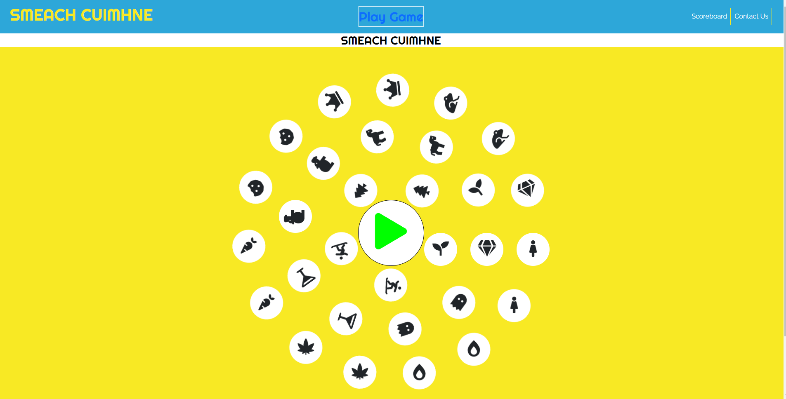

05/06/2021  
Link to site has been sent to friends and family to test across a variety of devices. The following issues have arose:

- On mobile device, the scoreboard is flowing over the edge. Will need to reduce font size to fix. 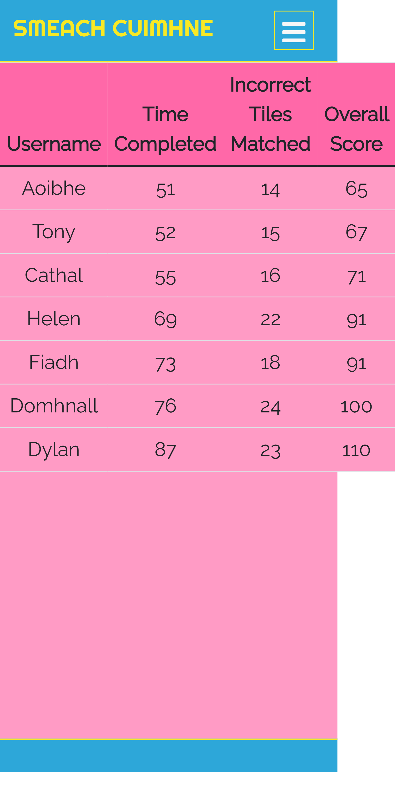

- When submitting to scoreboard, user is able to submit the same score multiple times to scoreboard. Need to deactivate Save to Scoreboard button in Congrats message post click to resolve. 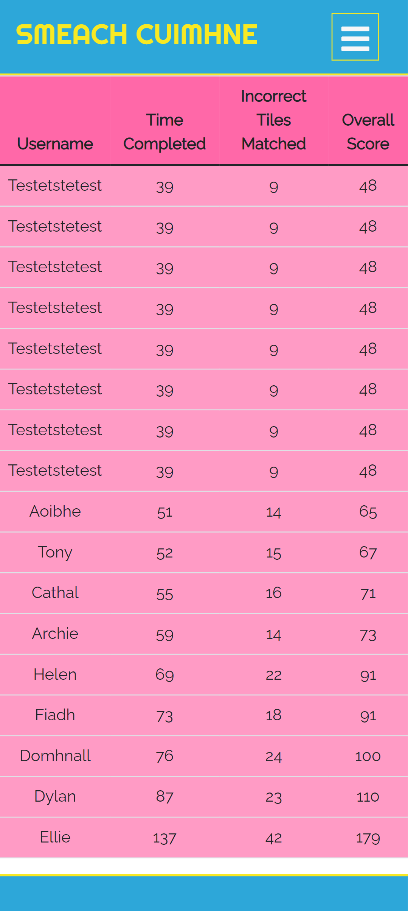

- When user clicks in to Hamburger Toggle Menu, play game is positioned on top of Scoreboard and Contact Us. Not sure what is causing it at this moment. Will need to test further. 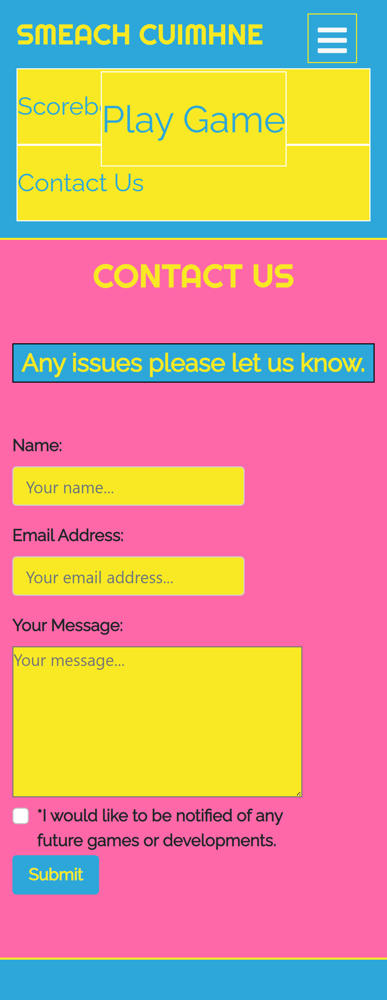

- On real iPhone 5/SE the website does not seem to be appearing well on index page and game page. The writing appears to be hovering outside its container on the Index page. 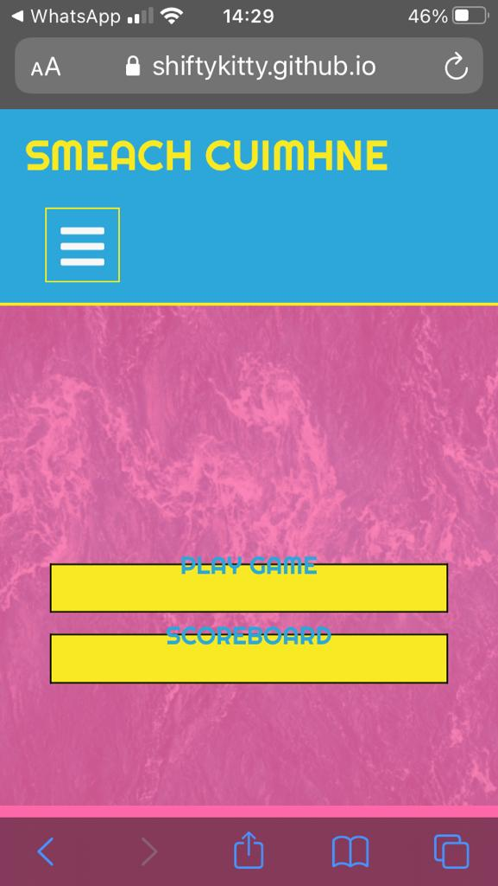

- Game Page issue on iPhone 5/SE. 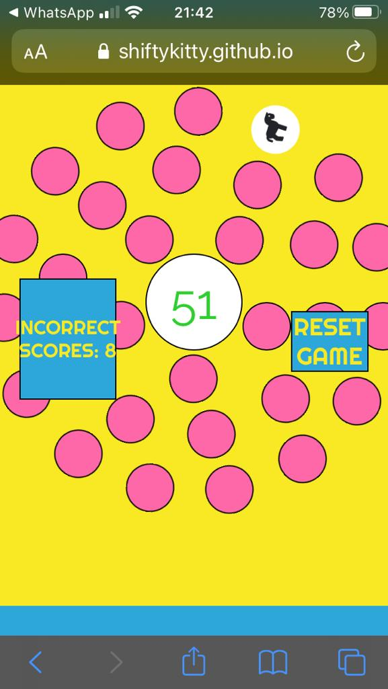

06/06/2021
The aforementioned issues have now been resolved with the following fixes:

- Scoreboard overflow issue was easily remedied by reducing font-size to 100% on mobile devices.

- Multiple score submission issue fixed by adding class "null" post "Save to Scoreboard" button click in JavaScript. This null class was designed for Game to prevent user from clicking timer when game was in play. It sets point-event to none. 
    -   Update: This has now been changed so that when user clicks Enter to Scoreboard, they are now brought back to game. 

- Play game tab appearing over toggle menu has been fixed. Cause was related to postioning Play Game button in center of Nav Bar. To fix, set position to inherit and set transform: translate(0%, 0%) for max screen width 990px. 

- Both appearance issues on iphone 5/se on index and game pages have now been resolved. Despite what is showing in Chromes Dev tools, on real device the display issues were present and it took making changes that go against appearance in Dev tools to fix on real device. Screenshots of issue fix below:

Index page fix on iPhone 5/Se 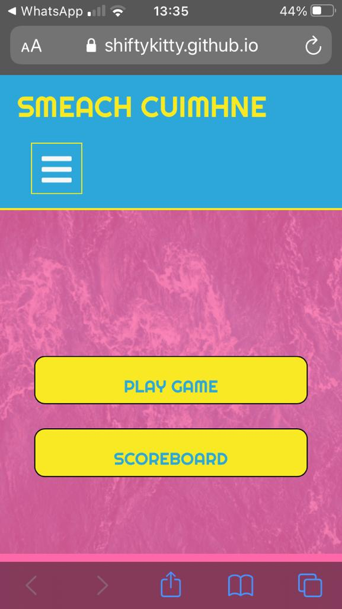

Game page fix on iphone 5/Se 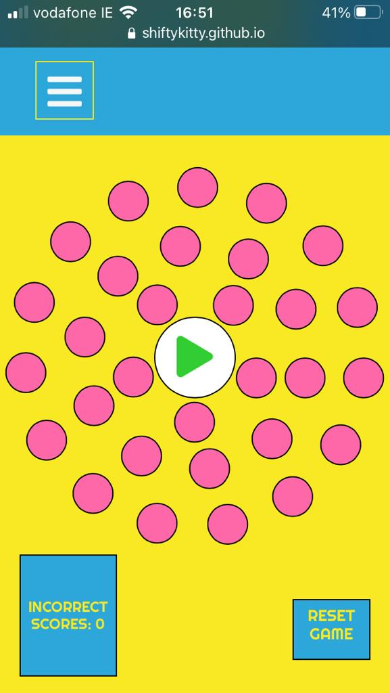

- Icon issue now fixed. Resolved by targeting the divs within the tile divs and negatively rotating it eg rotate(108deg) becomes rotate(-108deg) and so on. Icons still maintain proper upright direction even during tile swap. 

06/06/2021 (cont)

- Put HTML code through [W3C Markup Validation Service](https://validator.w3.org/) which brought back errors to fix. 

- Put CSS code through [W3C CSS Validation Service](https://jigsaw.w3.org/css-validator/) which brought back errors to fix. 

06/06/2021 (cont)

- Put HTML code through [W3C Markup Validation Service](https://validator.w3.org/) which now is presenting no issues after fixing.

- Put CSS code through [W3C CSS Validation Service](https://jigsaw.w3.org/css-validator/) which now is presenting no issues after fixing.

06/06/2021 (cont)

Following testing and peer review with Spencer Barriball, the following issues have appeared:

- Reset Button not resetting game during initial 3,2,1.. countdown sequence. This has now been fixed by reloading the page when Reset Button has been pressed. 

- Suggestion raised that when user submits/saves score to scoreboard the congrats message is to disappear. This has been done now by reloading the page once user successfully logs score. 

- While Spencer was playing/testing the game, I noticed that the tile switch aspect caught him off guard slightly. Therefore it may be necessary to add a few lines on the game page detailing how to play the game. 

 
 

### Development Life Cycle

Project Smeach Cuimhne maintained its design and functionality from conception pretty much consistently throughout the entire production. 

The main key feature that did not make final project was the implementation of the Switch Off button to toggle off the switching functionality that occurs when a user makes an incorrect match. I decided that this will be a seperate game entirely and will be added on at a later date. 

This section is to document and show the development process of this project, adhering to the user goals/stories and wireframes established earlier in this README doc. 

#### Day 1 - Designing the Game Board:
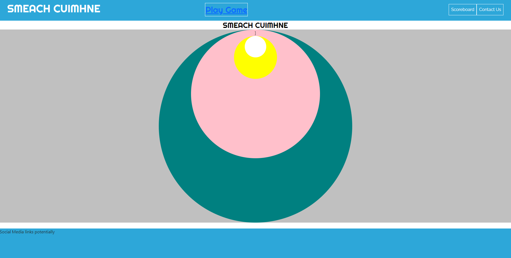

Seeing as the Game was/is the main part of this site, the majority of my time was spent working on this. 
Day 1 saw the Game board take its shape so that I could visualize how the rings would appear on screen. 
The white circle in center would eventually become the timer we see in final product while the yellow, pink and green circles would provide shape to the inner, middle and outer rings. 

#### Day 2 - Designing the Game Board:
 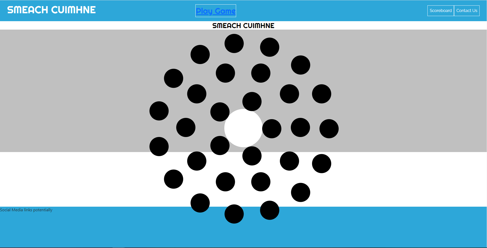

Following on from this was the creation of the tile pieces I would like to use. From the very beginning I wanted to implement circle patterns as the base shape for the board and pieces. This matching game format is a game concept as old as time itself. I wanted to add my own twist to it and reinvent the wheel so to speak so circles was the shape I went for. 

The entire game was centered at this stage and the circles used to help visualize and shape the board were removed.

#### Day 4 - Designing the Game Board:
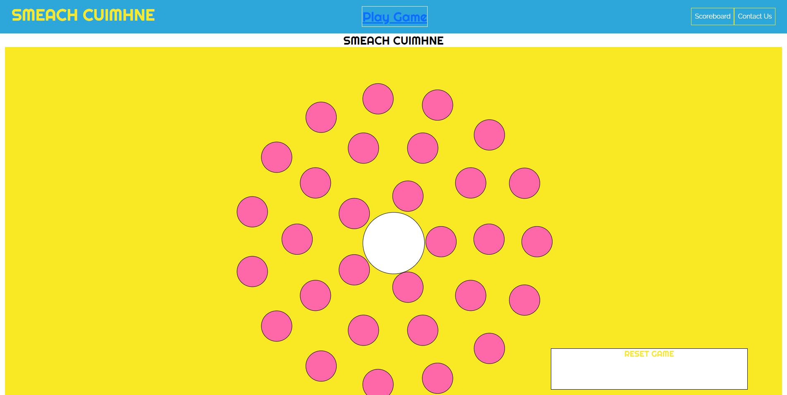

Day 4 saw the main coloring added to the game board and tiles. From the beginning, I decided on using colours blue, pink and yellow as explained in the Color section under The Surface Plane. 
#### Day 5 - Designing the Game Board:

A major inspiration behind the design of this game was my friend Elise Legg who is a big fan of memory type games. Throughout the design and production process I wanted to make a game that I thought she would enjoy to play. Therefore, as tribute to her the icons selected are various things that come to my mind when I think of her.  

#### Day 6 to Day 14 - Adding JavaScript:
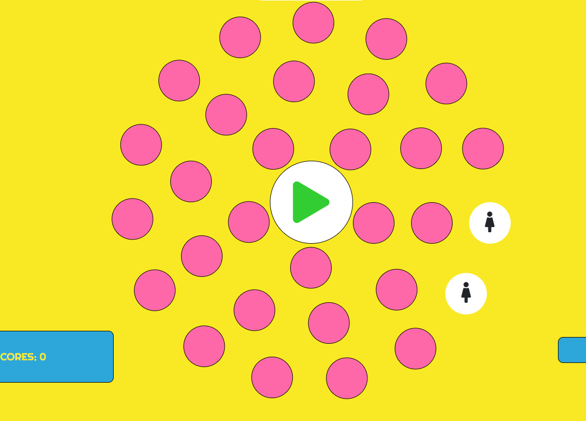
Once the gameboard and tiles pieces were developed it was time to add interactivity and game functionality. 

The first thing developed was the tile matching system. The main sources of inspiration for this functionality came from Youtubers [Web Dev Junkie](https://www.youtube.com/c/WebDevJunkie), [Web Dev Simplified](https://www.youtube.com/channel/UCFbNIlppjAuEX4znoulh0Cw) and [PortEXE](https://www.youtube.com/channel/UCjGQyJCSU_VVMTu5nigonqg) as well as various Stack Overflow articles on this (referenced below in Credit section). These sources helped give me good insight in how to implement this tile matching functionality in my own game and also how to proceed with the rest of the JavaScript within my game. 

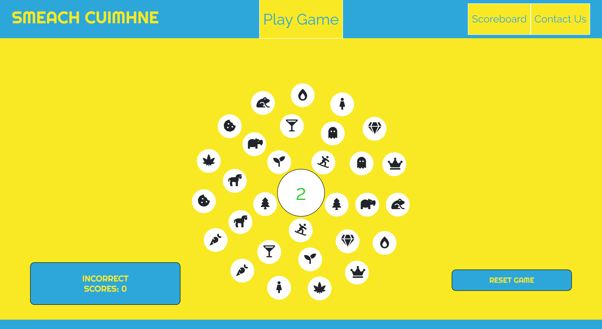

Following this was the Shuffle functionality. This caused a lot of issues early on. At the beginning I wanted to implement the Fisher Yates Shuffling algortithm however due to the tiles for this game being stored in three seperate divs, I was unable to work this algorithm into my project. However, I found a way around this thanks to inspiration taken from various Stack Overflow articles. (referenced below in Credit section). 

Once this was done, I decided to tackle the Incorrect match function. To do this, I needed Incorrect Score Tally to go up on condition that incorrect match was made and the Swap Div functionality on the condition that an incorrect match led to the incorrect selected tiles switching places. To achieve this swapping functionality, code was taken and adapted from numerous Stack Overflow sources. (referenced below in Credit section). 

After this, I needed to find a way to end the game. This was acheived when user made 15 correct matches, alert would appear saying "Congratulations". 

#### Day 15 to Day 21 - Adding JavaScript:

Once the main functionality of the game was set, it was time to work on adding timer functionality so that when timer/play button was pressed the game would begin. This was done by utilizing jQuery. 

Following on from this, the Congrats end game message was enhanced showing users time completed, incorrect matches made and total overall score. This message also had area for user to enter their so their score would be added to scoreboard. 

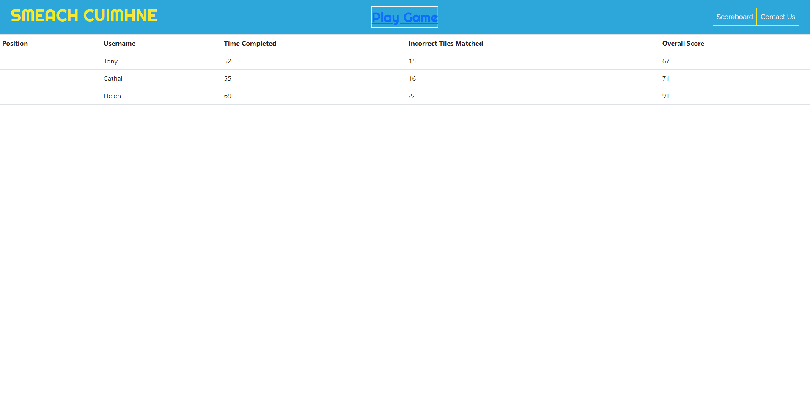

These values were then saved to local storage where they would then be taken and subsequentally added to the Scoreboard. This marked the end of the game development. 

Next, contact page was created requesting user name, email and address. This form was then hooked up to my email using Email.js (referenced below in Credits section) 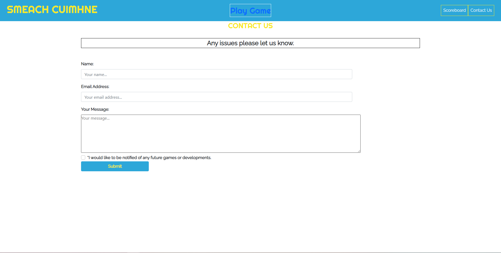

Index page was then created allowing user to access either Game or Scoreboard.
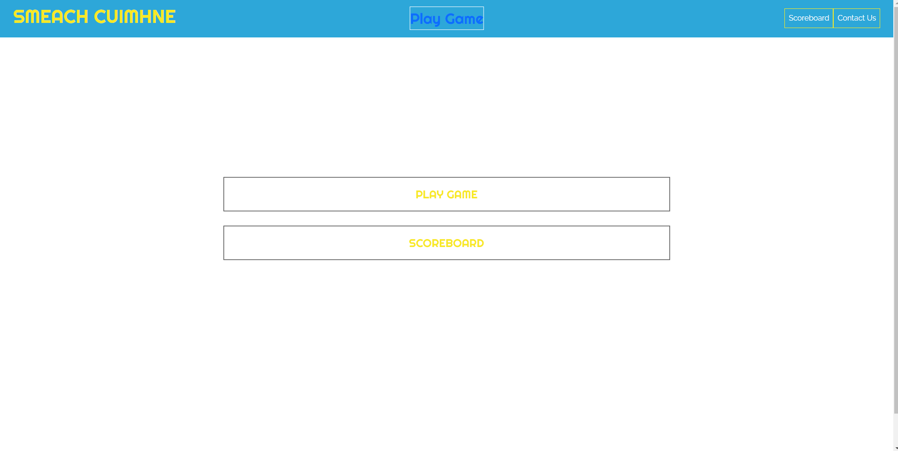

 
 
 

### Project Final Deploy and User Story Adherence

#### Index Page
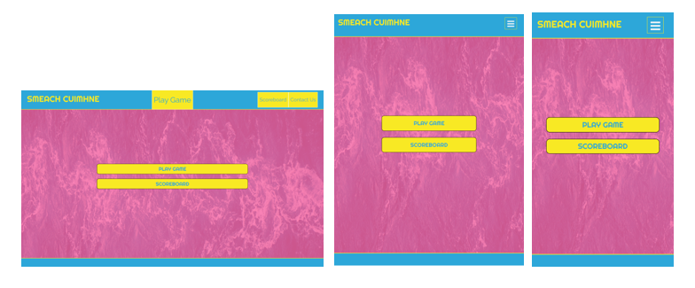
Index page showcases the main navigation page. As mentioned earlier in this document, eventually I would like to introduce more games. This index page will be where majority of navigation will take place. 

Opening screen is fun and enticing and shows users exactly where they need to go to for what they need. 

#### Game Page
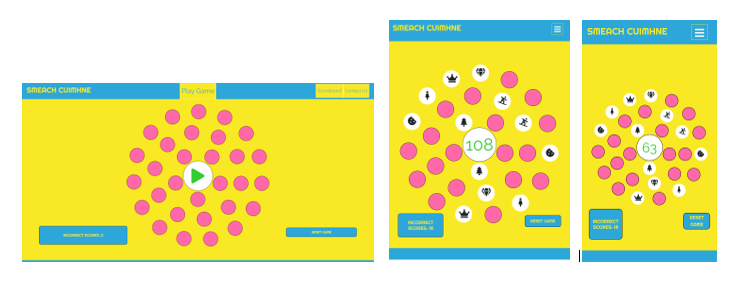
Screenshots show final game page with the game in action on both mobile and tablet devices. Once user presses middle play button, the game begins. 

A slight concern I had during intial stages of game development was that the game would not appear well on mobile. I have tested rigourously on iphone 5s with a screen width of roughly 320px and it performs great and a lot better than i expected meaning that it is the perfect game for someone on the move.

With the swapping function in place, the game proved also to be a lot more challenging than initially expected but not impossible. I found as a user, my performance within the game increased the more I played it. 

#### Congrats Message
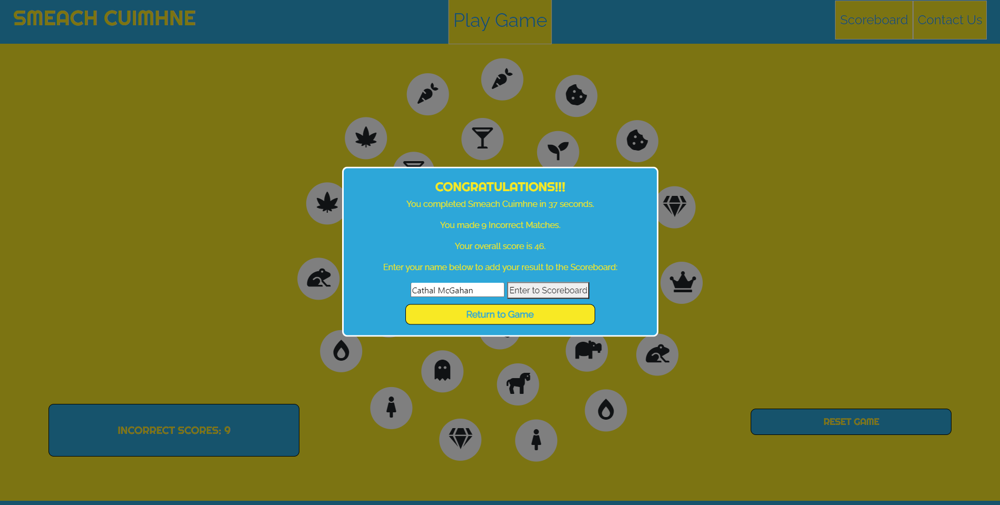

Once user beats game, the below Congratulations message appears. Here, we show the users time completed, incorrect matched tiles, overall score (addition of time completed and incorrect tiles matched) and an area for the user to enter their name. Once Enter to Scoreboard has been pressed, users score is saved in Local Storage to be used in Scoreboard. 

#### Scoreboard Page
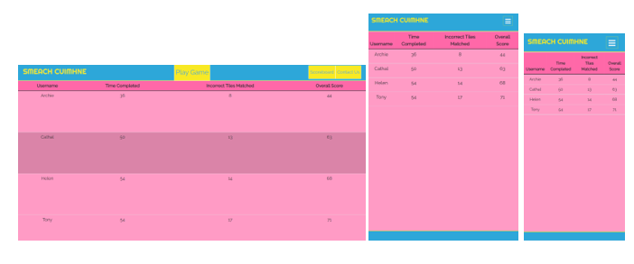
Here we have the scoreboard that takes the data saved in Local Storage and displays here. 
Ideally I would like this scoreboard to incorporate all users who play this games scores rather than just for that users session. This might be something I look into sorting out in the future. 

Scoreboard is sorted by Overall Score in descending order meaning the player with the lowest sum of Time Completed and Incorrect Matches is deemed the best player. 
This also allows the user to track their scores and progress with each playthrough being recorded. 

#### Contact Us
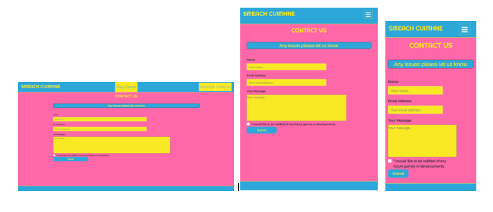

Contact us page was designed to allow users voice their opinions of the game to me and report any issues that may arise. The contact form is successfully hooked up to my email via Email.js. 

#### Thank You message
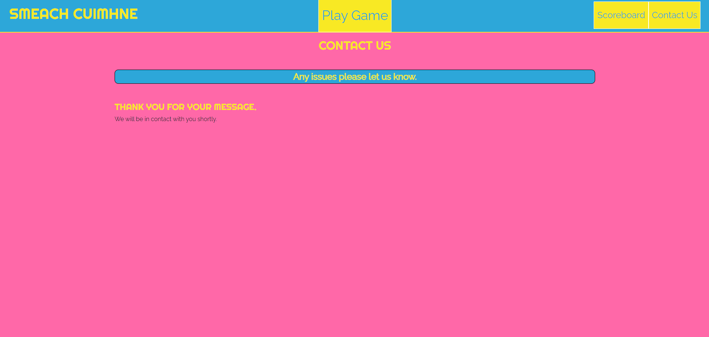

Once user has successfully sent a message from the contact page, the form is replaced by a Thank You message informing the user that someone will be in contact shortly.

07/06/2021  
Final day of testing before submission. Have made changes to HTML and CSS to slightly explain the game. This was not something I wished to do but ideally I want user to pick up the game and play with no frustration, therefore this may be necessary. 

